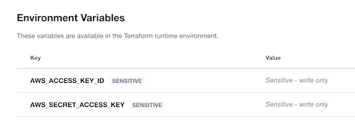

# TeamCity Terraform Kotlin DSL Test

This repo is for testing automated terraform deployments using TeamCity Kotlin DSL,
 Terraform Enterprise (or Cloud) and AWS.
 
## Prerequisites

### Local
* Terraform
* Docker & Docker Compose

### Remote
* Terraform Enterprise 
* AWS

## Running

### Terraform Enterprise Setup

Create a user or team API key for Terraform Enterprise (or Cloud) and store as described below.

Create a different workspace for each environment.

In each workspace create AWS account credentials and store them as environment variables


### Local

Run local TeamCity stack

```shell script
cd ci
docker-compose up -d
# once running get super admin token for first login
grep -E 'token\: [0-9]{16,22}' teamcity-server-logs/teamcity-server.log | tail -1
```

Setup a manual connection to this repo with git credentials using the identified `settings.kts` file

Create local TF Enterprise token authentication config in `~/.terraformrc`

```hcl-terraform
credentials "app.terraform.io" {
  token = "AAAA.BBBBB.CCCCC"
  # this being a team or user token (not an organisation token)
}
```

Run terraform plan (this will only run against dev)
```shell script
terraform init
terraform plan
```

### CI

Create a TF Enterprise token and add as an environment variable in CI called xxxxxx.

Use a Terraform capable build agent with TeamCity

CI (kotlin) will pick up this variable and use it to authenticate.
